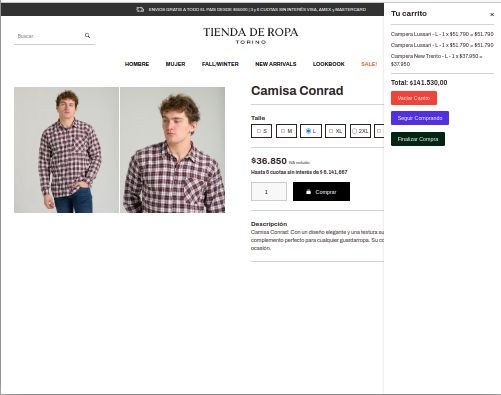

# Proyecto Tienda de Ropa

Proyecto Final para el curso de JavaScript de Coderhouse (Agosto 2023). Es un e-commerce para una tienda de ropa construido con HTML, CSS y JavaScript.

Vista previa:

## Características

- **Carga dinámica de productos**: Los productos se cargan desde un archivo JSON.
- **Filtro de Productos**: Filtrado dinámico de productos según categoría.
- **Página de producto individual**: Al hacer clic en un producto, se redirige a una página de producto individual con detalles del mismo.
- **Carrito de compras**: Funcionalidad para agregar productos al carrito y visualizarlos.
- **Persistencia**: Los productos en el carrito se guardan en `localStorage`.
- **Alertas e interactividad**: Implementación de `SweetAlert` para alertas y `Toastify` para notificaciones.
- **Buscador de productos**: Permite buscar productos por su nombre.

## Estructura Principal del Código

### Funciones Principales

- `displayProductosItems()`: Función para cargar y mostrar los productos. Se utiliza para la primera carga inicial y para mostrar los productos filtrados.
  
- `displayCategoriasItems()`: Función que carga y muestra las categorías junto con la cantidad de productos en cada una.
  
- `addListeners()`: Agrega listeners a los filtros de categorías.

- `buscarProductos()`: Funcionalidad de la barra de búsqueda.

- `cargarProductos()`: Función asíncrona que carga los productos y las categorías desde el archivo JSON.

- `agregarAlCarrito()`: Agrega un producto seleccionado al carrito de compras y actualiza el localStorage.

- `renderizarCarrito()`: Carga y renderiza el carrito desde el localStorage.

- `enviarPorWhatsApp()`: Envía el resumen del carrito a un número predefinido vía WhatsApp.

### Interacciones

El sitio incluye interactividad con el usuario utilizando las bibliotecas `SweetAlert` y `Toastify`.

## Prueba la Aplicación

Para probar la aplicación, puedes ir a la página de demostración alojada en GitHub Pages haciendo click en el siguiente enlace:

* https://pablospata.github.io/tienda-de-ropa-js/

## Tecnologías utilizadas

- HTML, CSS y JavaScript

## Autor

Pablo L. Spata